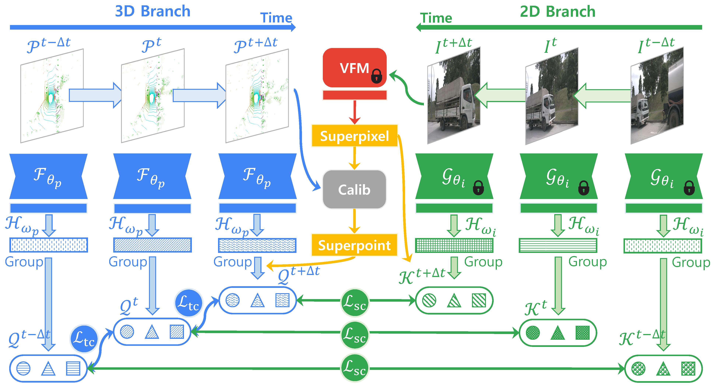

<div align="right">English | <a href="./README_CN.md">简体中文</a></div>

<div align="center">
    <h2><strong>4D Contrastive Superflows are Dense 3D Representation Learners</strong></h2>
</div>

<div align="center">
    <a href="https://xiangxu-0103.github.io/" target='_blank'>Xiang Xu</a><sup>1,*</sup>,&nbsp;&nbsp;&nbsp;
    <a href="https://ldkong.com/" target='_blank'>Lingdong Kong</a><sup>2,3,*</sup>,&nbsp;&nbsp;&nbsp;
    <a href="https://scholar.google.com/citations?user=zG3rgUcAAAAJ" target='_blank'>Hui Shuai</a><sup>4</sup>,&nbsp;&nbsp;&nbsp;
    <a href="http://zhangwenwei.cn/" target='_blank'>Wenwei Zhang</a><sup>2</sup>,&nbsp;&nbsp;&nbsp;
    </br>
    <a href="https://scholar.google.com/citations?user=lSDISOcAAAAJ" target='_blank'>Liang Pan</a><sup>2</sup>,&nbsp;&nbsp;&nbsp;
    <a href="https://scholar.google.com/citations?user=eGD0b7IAAAAJ" target='_blank'>Kai Chen</a><sup>2</sup>,&nbsp;&nbsp;&nbsp;
    <a href="https://liuziwei7.github.io/" target='_blank'>Ziwei Liu</a><sup>5</sup>,&nbsp;&nbsp;&nbsp;
    <a href="https://scholar.google.com/citations?user=2Pyf20IAAAAJ" target='_blank'>Qingshan Liu</a><sup>4</sup>
    </br>
    <sup>1</sup>Nanjing University of Aeronautics and Astronautics&nbsp;&nbsp;&nbsp;
    <sup>2</sup>Shanghai AI Laboratory&nbsp;&nbsp;&nbsp;
    <sup>3</sup>National University of Singapore&nbsp;&nbsp;&nbsp;
    <sup>4</sup>Nanjing University of Posts and Telecommunications&nbsp;&nbsp;&nbsp;
    <sup>5</sup>S-Lab, Nanyang Technological University&nbsp;&nbsp;&nbsp;
</div>

<div align="center">
    <a href="https://arxiv.org/abs/2407.06190" target='_blank'>
        
    </a>
    <a href="https://xiangxu-0103.github.io/SuperFlow" target='_blank'>
        
    </a>
    <a href="" target='_blank'>
        
    </a>
    <a href="" target='_blank'>
        
    </a>
    <a href="" target='_blank'>
        
    </a>
</div>

## About

SuperFlow is introduced to harness consecutive LiDAR-camera pairs for establishing spatiotemporal pretraining objectives. It stands out by integrating two key designs: 1) a dense-to-sparse consistency regularization, which promotes insensitivity to point cloud density variations during feature learning, and 2) a flow-based contrastive learning module, carefully crafted to extract meaningful temporal cues from readily available sensor calibrations.



## Updates

- \[2024.07\] - Our paper is accepted by [ECCV](https://eccv2024.ecva.net/).

## Outline

- [Installation](#installation)
- [Data Preparation](#data-preparation)
- [Getting Started](#getting-started)
- [Main Results](#main-results)
- [License](#license)
- [Citation](#citation)
- [Acknowledgements](#acknowledgements)

## :gear: Installation

For details related to installation and environment setups, kindly refer to [INSTALL.md](./docs/INSTALL.md).

## :hotsprings: Data Preparation

Kindly refer to [DATA_PREPAER.md](./docs/DATA_PREPAER.md) for the details to prepare the datasets.

## :rocket: Getting Started

To learn more usage about this codebase, kindly refer to [GET_STARTED.md](./docs/GET_STARTED.md).

## :bar_chart: Main Results

### Comparisons of state-of-the-art pretraining methods

<table>
    <tr>
        <th rowspan="2">Method</th>
        <th rowspan="2">Distill</th>
        <th colspan="6">nuScenes</th>
        <th colspan="1">KITTI</th>
        <th colspan="1">Waymo</th>
    </tr>
    <tr>
        <td>LP</td>
        <td>1%</td>
        <td>5%</td>
        <td>10%</td>
        <td>25%</td>
        <td>Full</td>
        <td>1%</td>
        <td>1%</td>
    </tr>
    <tr>
        <td>Random</td>
        <td>-</td>
        <td>8.10</td>
        <td>30.30</td>
        <td>47.84</td>
        <td>56.15</td>
        <td>65.48</td>
        <td>74.66</td>
        <td>39.50</td>
        <td>39.41</td>
    </tr>
    <tr>
        <td>PPKT</td>
        <td>ViT-S</td>
        <td>38.60</td>
        <td>40.60</td>
        <td>52.06</td>
        <td>59.99</td>
        <td>65.76</td>
        <td>73.97</td>
        <td>43.25</td>
        <td>47.44</td>
    </tr>
    <tr>
        <td>SLiDR</td>
        <td>ViT-S</td>
        <td>44.70</td>
        <td>41.16</td>
        <td>53.65</td>
        <td>61.47</td>
        <td>66.71</td>
        <td>74.20</td>
        <td>44.67</td>
        <td>47.57</td>
    </tr>
    <tr>
        <td>Seal</td>
        <td>ViT-S</td>
        <td>45.16</td>
        <td>44.27</td>
        <td>55.13</td>
        <td>62.46</td>
        <td>67.64</td>
        <td>75.58</td>
        <td>46.51</td>
        <td>48.67</td>
    </tr>
    <tr>
        <td>SuperFlow</td>
        <td>ViT-S</td>
        <td>46.44</td>
        <td>47.81</td>
        <td>59.44</td>
        <td>64.47</td>
        <td>69.20</td>
        <td>76.54</td>
        <td>47.97</td>
        <td>49.94</td>
    </tr>
    <tr>
        <td>PPKT</td>
        <td>ViT-B</td>
        <td>39.95</td>
        <td>40.91</td>
        <td>53.21</td>
        <td>60.87</td>
        <td>66.22</td>
        <td>74.07</td>
        <td>44.09</td>
        <td>47.57</td>
    </tr>
    <tr>
        <td>SLiDR</td>
        <td>ViT-B</td>
        <td>45.35</td>
        <td>41.64</td>
        <td>55.83</td>
        <td>62.68</td>
        <td>67.61</td>
        <td>74.98</td>
        <td>45.50</td>
        <td>48.32</td>
    </tr>
    <tr>
        <td>Seal</td>
        <td>ViT-B</td>
        <td>46.59</td>
        <td>45.98</td>
        <td>57.15</td>
        <td>62.79</td>
        <td>68.18</td>
        <td>75.41</td>
        <td>47.24</td>
        <td>48.91</td>
    </tr>
    <tr>
        <td>SuperFlow</td>
        <td>ViT-S</td>
        <td>47.66</td>
        <td>48.09</td>
        <td>59.66</td>
        <td>64.52</td>
        <td>69.79</td>
        <td>76.57</td>
        <td>48.40</td>
        <td>50.20</td>
    </tr>
    <tr>
        <td>PPKT</td>
        <td>ViT-L</td>
        <td>41.57</td>
        <td>42.05</td>
        <td>55.75</td>
        <td>61.26</td>
        <td>66.88</td>
        <td>74.33</td>
        <td>45.87</td>
        <td>47.82</td>
    </tr>
    <tr>
        <td>SLiDR</td>
        <td>ViT-L</td>
        <td>45.70</td>
        <td>42.77</td>
        <td>57.45</td>
        <td>63.20</td>
        <td>68.13</td>
        <td>75.51</td>
        <td>47.01</td>
        <td>48.60</td>
    </tr>
    <tr>
        <td>Seal</td>
        <td>ViT-L</td>
        <td>46.81</td>
        <td>46.27</td>
        <td>58.14</td>
        <td>63.27</td>
        <td>68.67</td>
        <td>75.66</td>
        <td>47.55</td>
        <td>50.02</td>
    </tr>
    <tr>
        <td>SuperFlow</td>
        <td>ViT-L</td>
        <td>48.01</td>
        <td>49.95</td>
        <td>60.72</td>
        <td>65.09</td>
        <td>70.01</td>
        <td>77.19</td>
        <td>49.07</td>
        <td>50.67</td>
    </tr>
</table>

### Domain generalization study

<table>
    <tr>
        <th rowspan="2">Method</th>
        <th colspan="2">ScriKITTI</th>
        <th colspan="2">Rellis-3D</th>
        <th colspan="2">SemPOSS</th>
        <th colspan="2">SemSTF</th>
        <th colspan="2">SynLiDAR</th>
        <th colspan="2">DAPS-3D</th>
        <th colspan="2">Synth4D</th>
    </tr>
    <tr>
        <td>1%</td>
        <td>10%</td>
        <td>1%</td>
        <td>10%</td>
        <td>Half</td>
        <td>Full</td>
        <td>Half</td>
        <td>Full</td>
        <td>1%</td>
        <td>10%</td>
        <td>Half</td>
        <td>Full</td>
        <td>1%</td>
        <td>10%</td>
    </tr>
    <tr>
        <td>Random</td>
        <td>23.81</td>
        <td>47.60</td>
        <td>38.46</td>
        <td>53.60</td>
        <td>46.26</td>
        <td>54.12</td>
        <td>48.03</td>
        <td>48.15</td>
        <td>19.89</td>
        <td>44.74</td>
        <td>74.32</td>
        <td>79.38</td>
        <td>20.22</td>
        <td>66.87</td>
    </tr>
    <tr>
        <td>PPKT</td>
        <td>36.50</td>
        <td>51.67</td>
        <td>49.71</td>
        <td>54.33</td>
        <td>50.18</td>
        <td>56.00</td>
        <td>50.92</td>
        <td>54.69</td>
        <td>37.57</td>
        <td>46.48</td>
        <td>78.90</td>
        <td>84.00</td>
        <td>61.10</td>
        <td>62.41</td>
    </tr>
    <tr>
        <td>SLiDR</td>
        <td>9.60</td>
        <td>50.45</td>
        <td>49.75</td>
        <td>54.57</td>
        <td>51.56</td>
        <td>55.36</td>
        <td>52.01</td>
        <td>54.35</td>
        <td>42.05</td>
        <td>47.84</td>
        <td>81.00</td>
        <td>85.40</td>
        <td>63.10</td>
        <td>62.67</td>
    </tr>
    <tr>
        <td>Seal</td>
        <td>40.64</td>
        <td>52.77</td>
        <td>51.09</td>
        <td>55.03</td>
        <td>53.26</td>
        <td>56.89</td>
        <td>53.46</td>
        <td>55.36</td>
        <td>43.58</td>
        <td>49.26</td>
        <td>81.88</td>
        <td>85.90</td>
        <td>64.50</td>
        <td>66.96</td>
    </tr>
    <tr>
        <td>SuperFlow</td>
        <td>42.70</td>
        <td>54.00</td>
        <td>52.83</td>
        <td>55.71</td>
        <td>54.41</td>
        <td>57.33</td>
        <td>54.72</td>
        <td>56.57</td>
        <td>44.85</td>
        <td>51.38</td>
        <td>82.43</td>
        <td>86.21</td>
        <td>65.31</td>
        <td>69.43</td>
    </tr>
</table>

### Out-of-distribution 3D robustness study

<table>
    <tr>
        <th>#</th>
        <th>Initial</th>
        <th>Backbone</th>
        <th>mCE</th>
        <th>mRR</th>
        <th>Fog</th>
        <th>Rain</th>
        <th>Snow</th>
        <th>Blur</th>
        <th>Beam</th>
        <th>Cross</th>
        <th>Echo</th>
        <th>Sensor</th>
        <th>Avg</th>
    </tr>
    <tr>
        <td rowspan="8">Full</td>
        <td>Random</td>
        <td>MinkU-18</td>
        <td>115.61</td>
        <td>70.85</td>
        <td>53.90</td>
        <td>71.10</td>
        <td>48.22</td>
        <td>51.85</td>
        <td>62.21</td>
        <td>37.73</td>
        <td>57.47</td>
        <td>38.97</td>
        <td>52.68</td>
    </tr>
    <tr>
        <td>SuperFlow</td>
        <td>MinkU-18</td>
        <td>109.00</td>
        <td>75.66</td>
        <td>54.95</td>
        <td>72.79</td>
        <td>49.56</td>
        <td>57.68</td>
        <td>62.82</td>
        <td>42.45</td>
        <td>59.61</td>
        <td>41.77</td>
        <td>55.21</td>
    </tr>
    <tr>
        <td>Random</td>
        <td>MinkU-34</td>
        <td>112.20</td>
        <td>72.57</td>
        <td>62.96</td>
        <td>70.65</td>
        <td>55.48</td>
        <td>51.71</td>
        <td>62.01</td>
        <td>31.56</td>
        <td>59.64</td>
        <td>39.41</td>
        <td>54.18</td>
    </tr>
    <tr>
        <td>SuperFlow</td>
        <td>MinkU-34</td>
        <td>91.67</td>
        <td>83.17</td>
        <td>70.32</td>
        <td>75.77</td>
        <td>65.41</td>
        <td>61.05</td>
        <td>68.09</td>
        <td>60.02</td>
        <td>58.36</td>
        <td>50.41</td>
        <td>63.68</td>
    </tr>
    <tr>
        <td>Random</td>
        <td>MinkU-50</td>
        <td>113.76</td>
        <td>72.81</td>
        <td>49.95</td>
        <td>71.16</td>
        <td>45.36</td>
        <td>55.55</td>
        <td>62.84</td>
        <td>36.94</td>
        <td>59.12</td>
        <td>43.15</td>
        <td>53.01</td>
    </tr>
    <tr>
        <td>SuperFlow</td>
        <td>MinkU-50</td>
        <td>107.35</td>
        <td>74.02</td>
        <td>54.36</td>
        <td>73.08</td>
        <td>50.07</td>
        <td>56.92</td>
        <td>64.05</td>
        <td>38.10</td>
        <td>62.02</td>
        <td>47.02</td>
        <td>55.70</td>
    </tr>
    <tr>
        <td>Random</td>
        <td>MinkU-101</td>
        <td>109.10</td>
        <td>74.07</td>
        <td>50.45</td>
        <td>73.02</td>
        <td>48.85</td>
        <td>58.48</td>
        <td>64.18</td>
        <td>43.86</td>
        <td>59.82</td>
        <td>41.47</td>
        <td>55.02</td>
    </tr>
    <tr>
        <td>SuperFlow</td>
        <td>MinkU-101</td>
        <td>96.44</td>
        <td>78.57</td>
        <td>56.92</td>
        <td>76.29</td>
        <td>54.70</td>
        <td>59.35</td>
        <td>71.89</td>
        <td>55.13</td>
        <td>60.27</td>
        <td>51.60</td>
        <td>60.77</td>
    </tr>
    <tr>
        <td rowspan="4">LP</td>
        <td>PPKT</td>
        <td>MinkU-34</td>
        <td>183.44</td>
        <td>78.15</td>
        <td>30.65</td>
        <td>35.42</td>
        <td>28.12</td>
        <td>29.21</td>
        <td>32.82</td>
        <td>19.52</td>
        <td>28.01</td>
        <td>20.71</td>
        <td>28.06</td>
    </tr>
    <tr>
        <td>SLidR</td>
        <td>MinkU-34</td>
        <td>179.38</td>
        <td>77.18</td>
        <td>34.88</td>
        <td>38.09</td>
        <td>32.64</td>
        <td>26.44</td>
        <td>33.73</td>
        <td>20.81</td>
        <td>31.54</td>
        <td>21.44</td>
        <td>29.95</td>
    </tr>
    <tr>
        <td>Seal</td>
        <td>MinkU-34</td>
        <td>166.18</td>
        <td>75.38</td>
        <td>37.33</td>
        <td>42.77</td>
        <td>29.93</td>
        <td>37.73</td>
        <td>40.32</td>
        <td>20.31</td>
        <td>37.73</td>
        <td>24.94</td>
        <td>33.88</td>
    </tr>
    <tr>
        <td>SuperFlow</td>
        <td>MinkU-34</td>
        <td>161.78</td>
        <td>75.52</td>
        <td>37.59</td>
        <td>43.42</td>
        <td>37.60</td>
        <td>39.57</td>
        <td>41.40</td>
        <td>23.64</td>
        <td>38.03</td>
        <td>26.69</td>
        <td>35.99</td>
    </tr>
</table>

## License

This work is under the [Apache 2.0 license](LICENSE).

## Citation

If you find this work helpful for your research, please kindly consider citing our paper:

```latex
@inproceedings{xu2024superflow,
    title = {4D Contrastive Superflows are Dense 3D Representation Learners},
    author = {Xu, Xiang and Kong, Lingdong and Shuai, Hui and Zhang, Wenwei and Pan, Liang and Chen, Kai and Liu, Ziwei and Liu, Qingshan},
    booktitle = {European Conference on Computer Vision},
    year = {2024}
}
```

## Acknowledgements

This work is developed based on the [MMDetection3D](https://github.com/open-mmlab/mmdetection3d) codebase.

> <br>
> MMDetection3D is an open-source object detection toolbox based on PyTorch, towards the next-generation platform for general 3D perception. It is a part of the OpenMMLab project developed by MMLab.

We acknowledge the use of the following public resources during the couuse of this work: <sup>1</sup>[nuScenes](https://www.nuscenes.org/nuscenes), <sup>2</sup>[nuScenes-devkit](https://github.com/nutonomy/nuscenes-devkit), <sup>3</sup>[SemanticKITTI](http://www.semantic-kitti.org), <sup>4</sup>[SemanticKITTI-API](https://github.com/PRBonn/semantic-kitti-api), , <sup>5</sup>[WaymoOpenDataset](https://waymo.com/open), <sup>6</sup>[Synth4D](https://github.com/saltoricristiano/gipso-sfouda), <sup>7</sup>[ScribbleKITTI](https://github.com/ouenal/scribblekitti), <sup>8</sup>[RELLIS-3D](https://github.com/unmannedlab/RELLIS-3D), <sup>9</sup>[SemanticPOSS](http://www.poss.pku.edu.cn/semanticposs.html), <sup>10</sup>[SemanticSTF](https://github.com/xiaoaoran/SemanticSTF), <sup>11</sup>[SynthLiDAR](https://github.com/xiaoaoran/SynLiDAR), <sup>12</sup>[DAPS-3D](https://github.com/subake/DAPS3D), <sup>13</sup>[Robo3D](https://github.com/ldkong1205/Robo3D), <sup>14</sup>[SLidR](https://github.com/valeoai/SLidR), <sup>15</sup>[DINOv2](https://github.com/facebookresearch/dinov2), <sup>16</sup>[Segment-Any-Point-Cloud](https://github.com/youquanl/Segment-Any-Point-Cloud), <sup>17</sup>[OpenSeeD](https://github.com/IDEA-Research/OpenSeeD), <sup>18</sup>[torchsparse](https://github.com/mit-han-lab/torchsparse). :heart_decoration:
